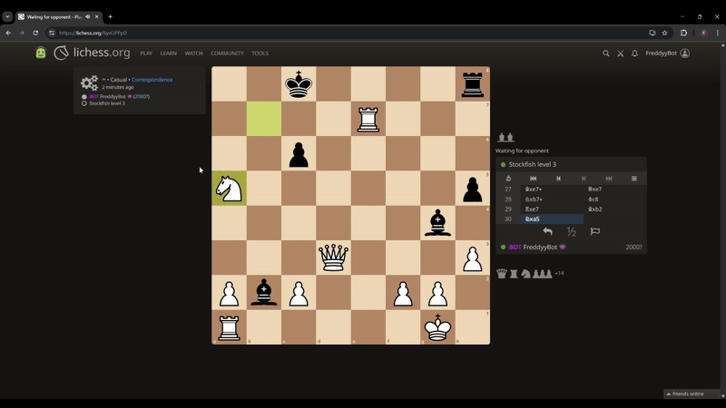

# What’s Up, I’m Freddy! ✌️

  

## 📝 About Me  
🎓 4th-Year Computer Engineering Student @ uOttawa — graduating Dec 2025  
🧠 Passionate about intelligent systems, optimization, and analytics  
📈 Metrics-driven developer: define KPIs → iterate → watch performance climb  
♟️🏀 Big on chess and basketball (especially stats/analytics)

### 🛠️ I Worked at  

### 🔗 Connect with Me  

## 🔧 Tech Stack  

## 🛠️ Featured Projects

♟️ [**FreddyyBot Chess Engine**](https://github.com/FreddyyAndrews/FreddyyBot)  
>Build from scratch with custom board representation and move generation.

:facepunch: [Send it a challenge on Lichess](https://lichess.org/@/FreddyyBot)
🖥️ C++, GTest, Performance Engineering

🏀 [**NBA MVP Predictor**](https://github.com/FreddyyAndrews/NBA-MVP-Predictor)  
> Scikit-learn regressions trained on historical stats to predict MVP outcomes. Correctly predicted Nikola Jokic as 2023-2024 MVP.

🖥️ Python, scikit-learn, pandas, matplotlib

🚁 [**TAILS Embedded System**](https://github.com/FreddyyAndrews/TAILS-Embedded)  
>Edge AI object detection and mapping for park rangers. Detects objects, gathers current GPS location, and transmits LoRa packets.

🖥️ Python, OpenCV, Edge AI, UART/SPI, LoRa, Raspberry Pi, GStreamer

🏗️ **Pipelined RISC Processor with Hazard Detection**
>Pipelined RISC CPU in VHDL that executes programs correctly under pipeline hazards via custom data and control hazard detection.

🖥️ VHDL, Quartus, FPGA, RISC

🚦 [**Traffic Light Control System (UART Debuggable)**](https://github.com/FreddyyAndrews/Traffic-Light-Control-System-With-UART)  
>Real-time traffic light controller with hardware inputs and live 9600-baud UART logging, deployed on Cyclone IV DE2-115.

🖥️ VHDL, FPGA, UART

## 🤝 Community Involvement

## 🧭 How I Work
- Define metrics first (Elo, accuracy, latency, score)
- Build small, test fast, iterate with data
- Prefer simple, explainable improvements with clear deltas
